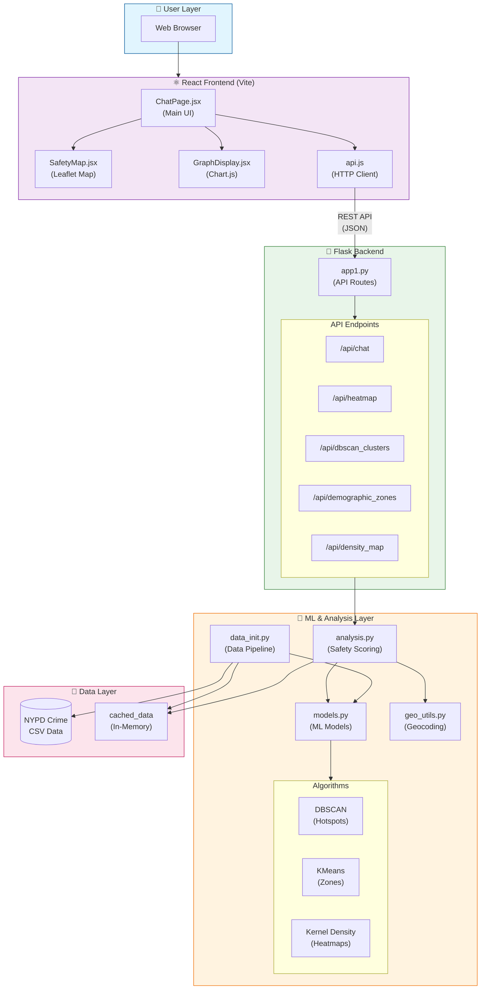

# Smart Cities Crime Safety Analysis System

A comprehensive crime safety analysis platform that uses machine learning to analyze crime patterns, predict safety scores, and provide real-time safety recommendations for locations in New York City.

**New to this project?** See `README_simple.md` for a beginner-friendly, step-by-step explanation.

## 🌟 Features

### Core Functionality
- **Real-time Safety Analysis**: Get instant safety assessments for any NYC location
- **Crime Pattern Detection**: DBSCAN clustering identifies crime hotspots
- **Demographic Analysis**: Understand victim demographics across different zones
- **Crime Density Mapping**: Visual heatmaps showing high/medium/low crime areas
- **Interactive Chat Interface**: Natural language queries for location safety
- **Emergency Location Sharing**: One-click location sharing with friends and family

### Machine Learning Models
- **KMeans Clustering**: Zone-based crime classification
- **DBSCAN**: Density-based spatial clustering for hotspot detection
- **Kernel Density Estimation**: Crime density heatmap generation
- **Demographic Profiling**: Victim characteristic analysis by zone

### Visualizations
- **Interactive Maps**: Leaflet-based crime cluster visualization
- **Crime Statistics Charts**: Bar charts showing crime type distribution
- **Multi-layer Maps**: Toggle between DBSCAN clusters, demographic zones, and density maps

## 🧱 System Architecture

The diagram below shows how all the pieces connect – from your browser down to the raw crime data.



### Architecture Overview

| Layer | Components | Purpose |
|-------|------------|---------|
| **User** | Web Browser | Entry point – user types queries and views results |
| **Frontend** | React + Vite, Leaflet, Chart.js | Chat UI, interactive maps, crime charts |
| **Backend** | Flask, REST API | Exposes `/api/*` endpoints for chat, heatmaps, clusters |
| **ML & Analysis** | scikit-learn, DBSCAN, KMeans, KDE | Crime hotspot detection, zone classification, density estimation |
| **Data** | NYPD CSV, in-memory cache | Raw crime records and precomputed model outputs |

## 🚀 Quick Start

### Prerequisites
- Python 3.8+
- Node.js 16+
- npm or yarn

### Backend Setup

1. **Navigate to project directory**
```bash
cd smart-cities-main   # or the folder name where you cloned this repo
```

2. **Install Python dependencies**
```bash
pip install -r requirements.txt
```

3. **Download required datasets**
See [DATA_SOURCES.md](DATA_SOURCES.md) for complete download instructions.

**Quick Start:**
- Download NYPD Crime Data: https://data.cityofnewyork.us/Public-Safety/NYPD-Complaint-Data-Current-Year-To-Date-/5uac-w243
- Place `NYPD_Complaint_Data_YTD.csv` in the project root or `backend/` directory

4. **Start the Flask backend**
```bash
cd backend
python app1.py
```

The backend will run on `http://localhost:5000`

### Frontend Setup

1. **Navigate to frontend directory**
```bash
cd frontend
```

2. **Install dependencies**
```bash
npm install
```

3. **Start development server**
```bash
npm run dev
```

The frontend will run on `http://localhost:5173`

## 📊 Model Evaluation

Run the model accuracy testing suite:

```bash
cd backend
python model_evaluation.py
```

This generates a comprehensive report including:
- **Clustering Quality Metrics**: Silhouette score, Davies-Bouldin index, Calinski-Harabasz score
- **Prediction Accuracy**: Zone classification performance
- **Safety Score Consistency**: Statistical analysis of safety scores
- **Overall System Assessment**: Combined performance rating

### Expected Performance Metrics
- **DBSCAN Silhouette Score**: > 0.25 (Good cluster separation)
- **Demographic Concentration**: > 40% (Moderate to strong patterns)
- **Zone Coverage**: 8+ zones (Good geographical coverage)

## 🏗️ Project Structure

```
smart_cities/
├── backend/
│   ├── app1.py                 # Flask API server
│   ├── analysis.py             # Safety analysis functions
│   ├── models.py               # ML model implementations
│   ├── data_init.py            # Data loading (prepare_data) and model training (train_models)
│   ├── geo_utils.py            # Geospatial utilities
│   ├── utils.py                # Helper functions
│   ├── model_evaluation.py     # Model accuracy testing
│   └── NYPD_Complaint_Data_YTD.csv
├── frontend/
│   ├── src/
│   │   ├── components/
│   │   │   ├── SafetyMap.jsx   # Interactive map component
│   │   │   ├── ChatBubble.jsx
│   │   │   ├── ChatInput.jsx
│   │   │   └── GraphDisplay.jsx
│   │   ├── pages/
│   │   │   └── ChatPage.jsx    # Main chat interface
│   │   ├── services/
│   │   │   └── api.js          # API client
│   │   ├── App.jsx
│   │   ├── App.css
│   │   └── main.jsx
│   ├── package.json
│   └── vite.config.js
├── requirements.txt
└── README.md
```

## 🔌 API Endpoints

### Safety Analysis
```
POST /api/chat
Body: { "message": "Restaurant, 123 Main St, New York" }
Response: Safety analysis with crime statistics and recommendations
```

### Crime Data
```
GET /api/heatmap
Returns: Crime heatmap data points

GET /api/dbscan_clusters
Returns: DBSCAN cluster information

GET /api/demographic_zones
Returns: Demographic zone profiles

GET /api/density_map
Returns: Crime density grid data
```

## 🎨 Frontend Components

### ChatPage
Main interface with:
- Message history display
- Location query input
- Real-time safety analysis
- Interactive map visualization
- Crime statistics charts
- Emergency location sharing button

### SafetyMap
Interactive Leaflet map showing:
- DBSCAN crime clusters (pink markers)
- Demographic zones (dark pink markers)
- Crime density zones (burgundy markers)
- Layer controls for toggling overlays

### Emergency Button
Fixed position button (bottom-right) that:
- Gets user's current location via Geolocation API
- Displays location coordinates
- Copies shareable location message to clipboard
- Provides Google Maps link

## 🛠️ Technologies Used

### Backend
- **Flask**: Web framework
- **Flask-CORS**: Cross-origin resource sharing
- **Pandas**: Data manipulation
- **NumPy**: Numerical computing
- **Scikit-learn**: Machine learning algorithms
- **Geopy**: Geocoding and distance calculations

### Frontend
- **React 19**: UI framework
- **Vite**: Build tool
- **Leaflet**: Interactive maps
- **React-Leaflet**: React bindings for Leaflet
- **Chart.js**: Data visualization
- **Axios**: HTTP client
- **Lucide React**: Icon library

## 📈 Usage Examples

### Query Format
```
"[Amenity], [Address]"

Examples:
- "Restaurant, Times Square, New York"
- "Park, Central Park West, Manhattan"
- "School, Brooklyn, NY"
```

### Response Includes
- Safety score (0-100)
- Dominant crime types
- Nearby crime count
- Time-of-day analysis
- Crime density classification
- Amenity information
- Visual map with clusters
- Crime distribution chart

## 🚨 Emergency Feature

The emergency button allows users to:
1. Click the red pulsing button (bottom-right corner)
2. Grant location permission when prompted
3. View their exact coordinates
4. Copy location message to clipboard
5. Share via SMS, WhatsApp, or any messaging app

**Emergency Message Format:**
```
🚨 EMERGENCY ALERT 🚨
I need help!
My location: https://www.google.com/maps?q=40.7580,-73.9855
Lat: 40.758000, Lon: -73.985500
```

## 🔧 Configuration

### Backend Configuration
Edit `backend/config.py` (if exists) or modify constants in `data_init.py`:
- Sample sizes for clustering
- Grid resolution for density maps
- Number of clusters/zones
- Distance thresholds

### Frontend Configuration
Edit `frontend/src/services/api.js`:
- API base URL (default: `http://localhost:5000`)
- Request timeout settings

## 🐛 Troubleshooting

### Map Not Displaying
- **Issue**: Leaflet map shows blank or doesn't render
- **Fix**: Ensure `leaflet/dist/leaflet.css` is imported in SafetyMap.jsx
- **Fix**: Check that LayerGroup wraps CircleMarker components
- **Fix**: Verify map container has explicit height in CSS

### Layout Issues
- **Issue**: Chart or map gets minimized
- **Fix**: CSS now uses flexbox on mobile, grid on desktop (1024px+)
- **Fix**: Min-height properties prevent collapse

### Backend Errors
- **Issue**: Module not found errors
- **Fix**: Run `pip install -r requirements.txt`
- **Issue**: Data file not found
- **Fix**: Ensure CSV file is in `backend/` directory

### CORS Errors
- **Issue**: Frontend can't connect to backend
- **Fix**: Verify Flask-CORS is installed and enabled
- **Fix**: Check backend is running on port 5000

## 📝 Model Details

### DBSCAN Clustering
- **Purpose**: Identify crime hotspots
- **Parameters**: eps=0.01, min_samples=5
- **Output**: Cluster centers with dominant crime types

### KMeans Clustering
- **Purpose**: Zone-based crime classification
- **Clusters**: 30 zones
- **Features**: Latitude, longitude (coordinates only for easier prediction)

### Demographic Analysis
- **Purpose**: Victim characteristic profiling
- **Zones**: 25 demographic zones
- **Features**: Age group, race, sex
- **Method**: KMeans with demographic + spatial features

### Crime Density
- **Purpose**: Classify areas by crime rate
- **Method**: Kernel Density Estimation
- **Grid**: 50x50 points over NYC
- **Classes**: Low, Medium, High

## 🤝 Contributing

To extend this project:
1. Add new ML models in `backend/models.py`
2. Create new API endpoints in `backend/app1.py`
3. Add frontend components in `frontend/src/components/`
4. Update model evaluation in `backend/model_evaluation.py`

## 📄 License

This project is for educational purposes.

## 👥 Authors

Smart Cities Crime Safety Analysis Team

## 🙏 Acknowledgments

- NYPD for crime data
- OpenStreetMap for map tiles
- React and Flask communities

---

**Note**: This system uses historical crime data for analysis. Always exercise caution and use multiple sources when assessing area safety.
