# Smart Cities Crime Safety – Simple Guide

This is a **"for dummies"** guide to help you understand and run the project without needing deep ML or web-dev knowledge.

If you want the full, detailed docs, read the main `README.md`.

---

## 1. What this project does (in plain English)

- You type a place like: `"Restaurant, Times Square, New York"`.
- The app looks up that location on a map.
- It checks historical NYPD crime data around that spot.
- It estimates **how safe** the area is and what kinds of crimes are common.
- It shows:
  - A **chat-style explanation** (safety score + tips).
  - An **interactive map** with crime clusters.
  - Basic **charts** about crime types.

Think of it as a **safety assistant for NYC locations**.

---

## 2. High-level system architecture

Here's a picture of how everything connects. Don't worry if some terms are new – explanations are right below the diagram.

```mermaid
flowchart TB
    subgraph YOU["👤 You"]
        Browser["Web Browser"]
    end

    subgraph FRONTEND["⚛️ Website (React)"]
        ChatPage["Chat Page"]
        Map["Interactive Map"]
        Charts["Crime Charts"]
    end

    subgraph BACKEND["🐍 Server (Python/Flask)"]
        API["API Endpoints"]
        Analysis["Safety Analysis"]
        ML["ML Models"]
    end

    subgraph DATA["💾 Data"]
        CSV[("NYPD Crime\nCSV File")]
    end

    Browser --> FRONTEND
    ChatPage --> Map
    ChatPage --> Charts
    FRONTEND -->|"sends your query"| API
    API --> Analysis
    Analysis --> ML
    ML --> CSV
    API -->|"returns safety info"| FRONTEND

    style YOU fill:#e1f5fe,stroke:#01579b
    style FRONTEND fill:#f3e5f5,stroke:#7b1fa2
    style BACKEND fill:#e8f5e9,stroke:#2e7d32
    style DATA fill:#fce4ec,stroke:#c2185b
```



### What each box means

| Box | What it is | Plain-English description |
|-----|------------|---------------------------|
| **You (Browser)** | Your web browser | Where you type your query and see results |
| **Chat Page** | React component | The main screen with the text input and chat bubbles |
| **Interactive Map** | Leaflet.js | Shows crime clusters as colored circles on a real map |
| **Crime Charts** | Chart.js | Bar/pie charts showing crime types |
| **API Endpoints** | Flask routes | URLs like `/api/chat` that the website calls |
| **Safety Analysis** | `analysis.py` | Calculates safety scores and recommendations |
| **ML Models** | `models.py` | Clustering algorithms (DBSCAN, KMeans) that find crime hotspots |
| **NYPD CSV** | Data file | Historical crime records from New York City |

### How a request flows

1. **You type** a location like `"Restaurant, Times Square, New York"` and press Enter.
2. **The website** sends your query to the Python server (`/api/chat`).
3. **The server** looks up the location, reads the crime data, runs ML models to calculate a safety score.
4. **The server responds** with safety info, crime types, and map data.
5. **The website** displays a chat message, updates the map, and shows a chart.

---

## 3. How to run it (step-by-step)

### 3.1. Backend (Python)

1. Open a terminal and go to the project folder:
   ```bash
   cd smart-cities-main   # or whatever folder name you used
   ```
2. Install Python packages:
   ```bash
   pip install -r requirements.txt
   ```
3. Put the NYPD CSV file in the `backend/` folder:
   - File name: `NYPD_Complaint_Data_YTD.csv`
   - Path: `backend/NYPD_Complaint_Data_YTD.csv`
4. Start the backend server:
   ```bash
   cd backend
   python app1.py
   ```
5. The backend should now be running at:
   - `http://localhost:5000`

### 3.2. Frontend (React)

1. Open another terminal and go to the frontend folder:
   ```bash
   cd smart-cities-main/frontend
   ```
2. Install Node.js dependencies:
   ```bash
   npm install
   ```
3. Start the dev server:
   ```bash
   npm run dev
   ```
4. Open the URL shown in the terminal (usually `http://localhost:5173`).

---

## 4. How to use the app

1. In the chat input, type a query like:
   - `"Restaurant, Times Square, New York"`
   - `"Park, Central Park, Manhattan"`
2. Press **Enter** or click the **Send** button.
3. Wait a moment while the backend analyzes the area.
4. You’ll see:
   - A **text explanation** of how safe the area is.
   - **Suggested precautions** based on crime patterns.
   - A **map** centered on your location with circles showing crime clusters.

There is also an **emergency button** on the map that lets you:
- Grab your current GPS location.
- Copy a ready-to-send emergency message with a Google Maps link.

---

## 5. Where things live (very simple)

- `backend/`
  - `app1.py` – main API server (auto-initializes data on first request).
  - `analysis.py` – safety analysis logic.
  - `models.py` – ML models (clustering, density, etc.).
  - `data_init.py` – data pipeline with:
    - `prepare_data()` – loads and cleans the CSV.
    - `train_models()` – fits all ML models.
    - `initialize_data()` – orchestrates the full pipeline.
- `frontend/`
  - `src/pages/ChatPage.jsx` – main chat screen.
  - `src/components/SafetyMap.jsx` – interactive map.
  - `src/services/api.js` – frontend API calls.

If you get stuck or want to dive deeper, switch to the full `README.md`.

